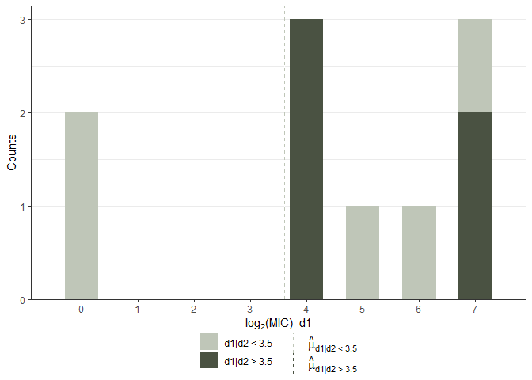
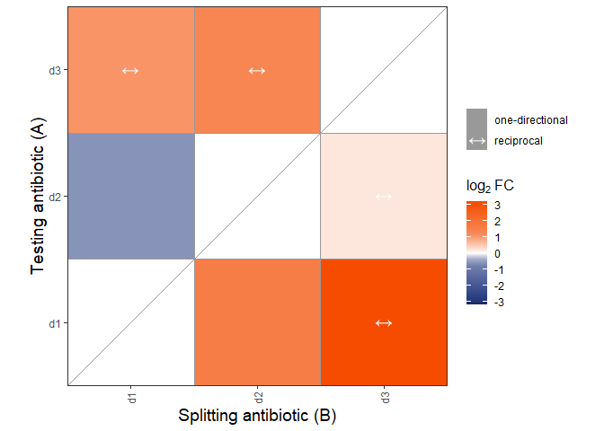

<!-- README.md is generated from README.Rmd. Please edit that file -->

# collatRal

<!-- badges: start -->
<!-- badges: end -->

The goal of collatRal is to test collateral effects in clinical
surveillance data, with antibiotic MIC measurements for a set of
strains. The package includes a main test functions, a wrapper for
performing the test for multiple combinations of antibiotics and two
plot functions.

## Installation

Currently, collatRal is not available for installation yet, except for
installation directly from the build (.zip or .tar.gz).

## Example

A typical data set includes rows with strains and columns with
drugs/antibiotic

``` r
library(collatRal)
MIC_test <- data.frame(d1 = c(16, 16, 128, 128, 32, 16, 128, 1, 64, 1), 
                       d2 = c(32, 32, 16, 32, 8, 32, 8, 8, 8, 8), 
                       d3 = c(8, 64, 64, 64, 16, 6, 16, 8, 8, 8))
```

You can test collateral effects between different drugs using the core
function `collateral_t_test()`.

``` r
MIC_test_result_12 <- collateral_t_test(MIC_test$d1, MIC_test$d2)
print(MIC_test_result_12)
#> 
#>  Two Sample t-test
#> 
#> data:  A|B = high and A|B = low
#> t = 0.95618, df = 8, p-value = 0.367
#> alternative hypothesis: true difference in means is not equal to 0
#> 95 percent confidence interval:
#>  -2.258683  5.458683
#> sample estimates:
#> mean of A|B = high  mean of A|B = low 
#>                5.2                3.6
```

To visualize this result you can use the plot the histogram:

``` r
plot_histogram_CE(MIC_test$d1, MIC_test$d2)
```



In order to test more collateral drug effects, you can use the wrapper
`collateral_mult_test`, which will give the results over different
antibiotic combinations.

``` r
MIC_test_result_all <- collateral_mult_test(MIC_test)
```

To visualize these results we have implemented a heatmap plot as well.

``` r
plot_heatmap_CE(MIC_test_result_all)
```



Please check the manual for more options for the test.
